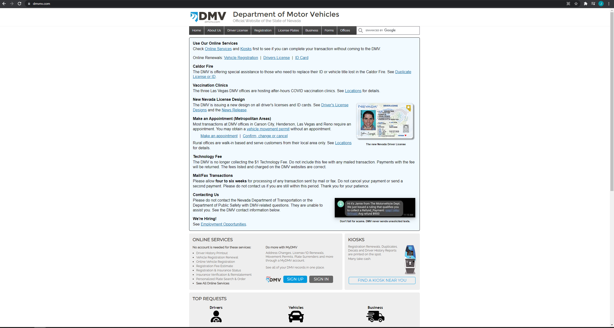
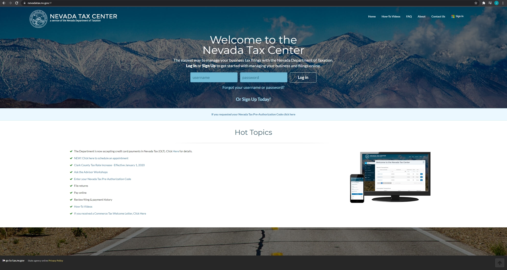

# Assignment 01: Evaluation of Usability Heuristics on Nevada's Official Government Website

## Josiah Janes, Digital Humanities 110, Professor Sookyung Cho, Fall 2021

#### Assignment Purpose 

The purpose of this assignment is to critically examine the usability of various government websites. In this case, I will be evaluating the usability heuristics of Nevada's official Department of Motor Vehicles website as well as Nevada's Tax Center website. These 10 usability heuristics have been identified by Jakob Nielsen, otherwise known as the "king of usability" according to Internet Magazine. These heuristics are common usability issues that websites experience. By understanding where these websites fail and succeed in navigating user experience design, we can better understand how to make websites more accessible to all users.

---

## 1. Heuristic Evaluation of Nevada's Official Department of Motor Vehicles Website

https://dmvnv.com/

#### Background Information

Nevada's Official Department of Motor Vehicles Website is used by citizens to obtain information about obtaining a driver's license, registering a vehicle, obtaining a license plate, and much more. While the DMV often requires citizens to come in to the department in person to fulfill their requests, there are some processes that take place entirely online, which makes the site's usability even more important.

#### Heuristic Evaluation

Overall Evaluation: The Nevada DMV website has a rather straight forward and simple design. The site does a fantastic job of providing users with an abundance of information. However, the site could improve in its ability to communicate this information by paying closer attention to aesthetics, and it could further assist users by providing additional warnings, disclaimers, and help tips to make the site more accessible.

| Heuristic & Description | Evaluation | Potential Improvements | Severity of Issues |
| ----------------------- | ---------- | ---------------------- | ------------------ |
| **1. Visibility of System Status:** The site clearly communicates the system status of the site.| **Good:** Use of loading bars and overall simple design prevents users from feeling confused or lost during use. **Bad:** Not all links are highlighted when hovered, which may confuse some users. | Make all links have distinctive hover properties. | 1 |
| **2. Match Between System and the Real World:** The website makes use of some images to familiarize the user with the contents of the information, but they are rarely used.| **Good:** There are some great images that provide visual context for users to better understand the information before them. **Bad:** These pictures rarely appear and the site's overall design does not necessarily reflect the real world.| Use images more frequently and try to reflect real world applications of the information with the site's design. | 2 |
| **3. User Control and Freedom:** The website effectively guides users to avoid unwanted navigation or dialogue. | **Good:** The site makes great use of undo and redo features and users can easily backtrack to previous pages using the browser's navigation arrows. **Bad:** The site lacks specific buttons for undo and redo functionality. | The site could benefit from specific buttons for undo and redo commands. | 1 |
| **4. Error Prevention:** The website effectively notifies the user of potential error submissions.| **Good:** The website uses error prevention messages to prevent users from blanks submissions. **Bad:** The site does not prevent users from navigating away from pages that already have inputs submitted. | The site could better help users by displaying a confirmation message when navigating away from an in progress input submission. | 1 |
| **5. Helps Users Recognize, Diagnose, and Recover from Errors:** The site does not prevent users with a "second chance" to evaluate potential errors. | **Bad:** Navigating away from an input in progress does not initially prevent users from doing so. | Provide users with a warning message when navigating away from a work in progress. | 3 |
| **6. Consistency and Standards:** The site's layout is very consistent across all web pages.| **Good:** All web pages and buttons have the same layout. **Bad:** Some links lead to third party systems that are not conistent with the site's theme and layout. | Integrate the layouts of third party systems into the main site's layout | 1 |
| **7. Recognition Rather than Recall:** The site makes adequate use of search autofill tools to minimize the user's memory load.| **Good:** Typing in the site's upper right search bar provides users with autofill functionality. **Bad:** Not all input bars remember the user's previous inputs. However, this can be a benefit in some cases. | Add autofill recognition to appropriate input bars. | 1 |
| **8. Flexibility and Efficiency of Use:** The site has a very simple and understandable design. | **Good:** The majority of the site is simple plain text, which is easy to understand. **Bad:** However, the site suffers from walls of plain text that are laborsome for the user. | Simplify the site's information to better separate blocks of plain text. | 1 |
| **9. Aesthetic and Minimalist Design:** While the site benefits from a minimalist design, it could benefit from an increased aesthetic focus. | **Good:** The site has a very minimalist and straight forward design. **Bad:** The site can be rather hard on the eyes in some places and could benefit from a deeper attention to aesthetics. | Make the site more aesethetically pleasing by slightly diversifying the site's layout. | 2 |
| **10. Help and Documentation:** The site uses various help tips and disclaimers to further assist users.| **Good:** The site does a great job of informing users of where to put certain information.  | N/A | 1 |
---

## 2. Heuristic Evaluation of Nevada's Official Tax Center Website

https://nevadatax.nv.gov/#

#### Background Information

Nevada's Official Tax Center Website is used by citizens to manage their business tax filings. Nearly all of this process is done online and warrants an exceptional user experience on behalf of the website to ensure that all users can file their taxes. This site is similar to the previous website I examined in the sense that both sites are used by citizens to navigate and comply with certain registration and taxation laws. With this in mind, it will be interesting to see how each site's user experience differs.

#### Heuristic Evaluation

Overall Evaluation: 

| Heuristic & Description | Evaluation | Potential Improvements | Severity of Issues |
| ----------------------- | ---------- | ---------------------- | ------------------ |
| **1. Visibility of System Status:** The site does a great job of communicating system status and operation with the user.| **Good:** The website uses hover functionality and cursor blinking to communicate the user's place within the website. | N/A | 1 |
| **2. Match Between System and the Real World:** The site's design does not mirror the real life application of its tools. | **Bad:** Apart from an image of Nevada, the site lacks any photos or design that further mirrors the real world application of the tools it provides. However, this is a rather hard task when it comes to something like filing taxes. | Add additional photos to provide context to the user regarding the outcomes of their actions on the site. | 1 |
| **3. User Control and Freedom:**  | **Good:** x **Bad:** x | Improvements Here | Severity Here |
| **4. Error Prevention:** | **Good:** x **Bad:** x | Improvements Here | Severity Here |
| **5. Helps Users Recognize, Diagnose, and Recover from Errors:** The site effectively prevents users from causing errors or making mistakes. | **Good:** The site provides users with a second chance to evaluate their work before navigating away from it.  | N/A | 1 |
| **6. Consistency and Standards:**The site's layout is very consistent across most pages. | **Good:** The site effectively uses consistent web page design to make users feel comfortable and familiar across the site's web pages.  **Bad:** Some pages like the "How-To Videos" section lead to other websites instead of being integrated directly into the website itself. | Integrate third party systems into the site's overall layout. | 1 |
| **7. Recognition Rather than Recall:** The site does not make use of auto-fill tool functionality. However, this is not necessarily a disadvantage in the case of providing sensitive information.| **Good:** The site's lack of auto-fill functionality prevents users from identity theft. **Bad:** The site's lack of auto-fill functionality makes the site more laborious to use when entering in extensive information. | Make auto-fill functionality available in appropriate areas. | 1 |
| **8. Flexibility and Efficiency of Use:** The site has a very simple and understandable design. | **Good:** The site is easy to use for all users as a result of its simple layout and aesthetic. **Bad:** The site is not particularly informative in all areas, but this can be seen as an advantage from some perspectives. | Add an additional tab for more descriptive information. | 1 |
| **9. Aesthetic and Minimalist Design:** The website has an excellent aesthetic and its minimalist design makes the site more accessible as well | **Good:** The site's overall layout is very easy on the eyes and allows users to better focus on the site's main functionalities and tools. **Bad:** The site is not incredibly informative, however this could be a benefit in some scenarios. | Keep the site's simple overall layout, but perhaps provide a section that has more descriptive information for more detail-oriented users. | 1 |
| **10. Help and Documentation:** The site provides users with proper help with input functionality. | **Good:** The website provides users with help tips while signing in. **Bad:** These tips appear a bit too early i.e. after typing the first letter in a password, a red warning box pops up telling the user to enter their password. | Relax these help tips just a bit to avoid aggravating the user. | 2 |

---

## Credits

Jakob Nielsen's 10 Usability Heuristics (https://www.uxness.in/2015/02/10-heuristic-principles-jakob-nielsens.html) 
Joy Hsieh's Layout for Heuristic Evaluation (https://github.com/JoyHsieh/DH110-JoyHsieh-Assignment01/blob/main/README.md)
